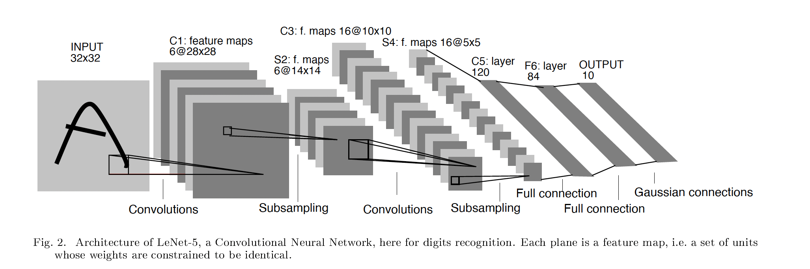
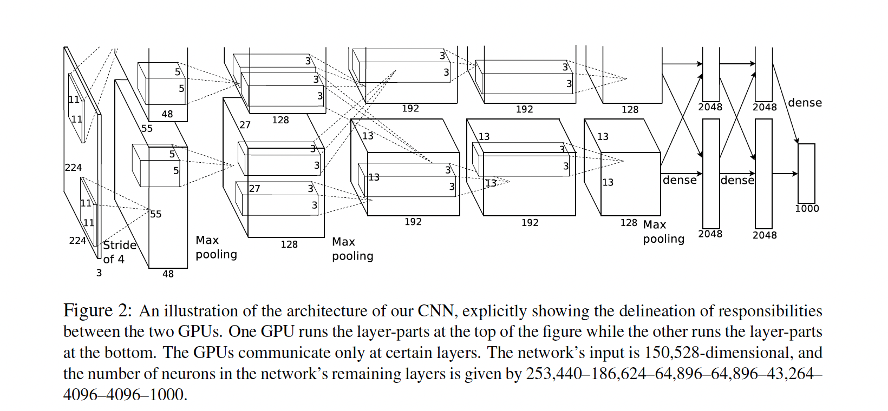
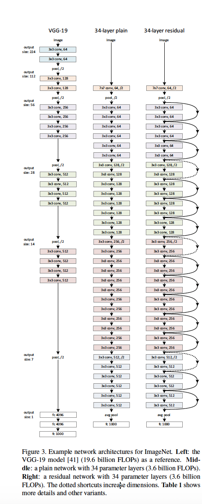
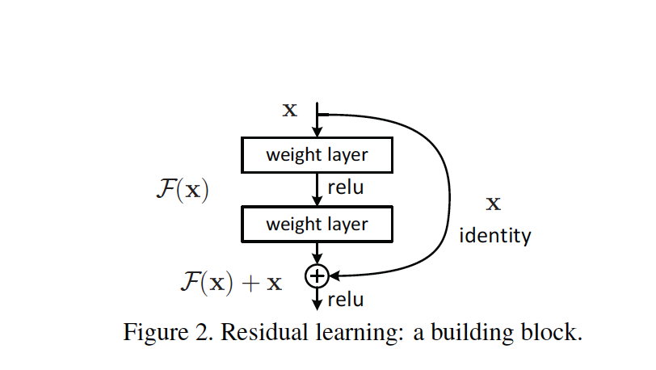
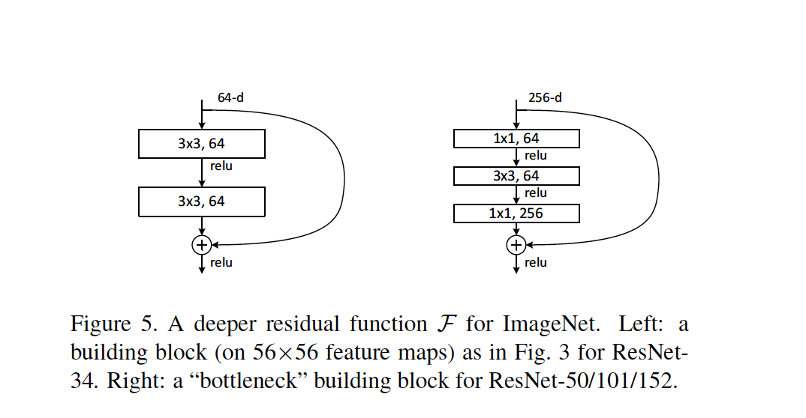
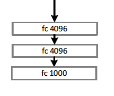
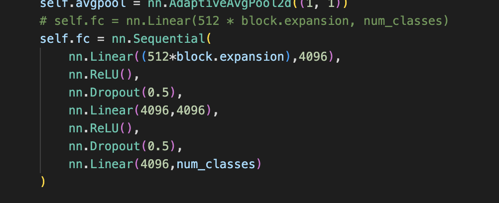
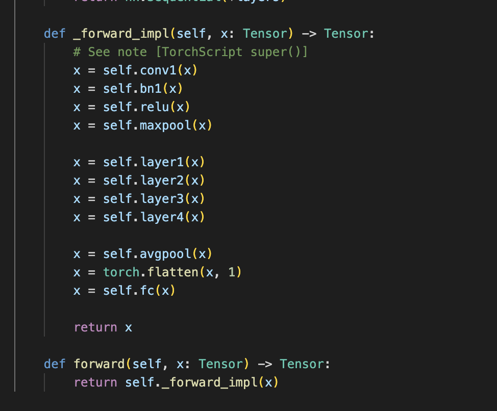
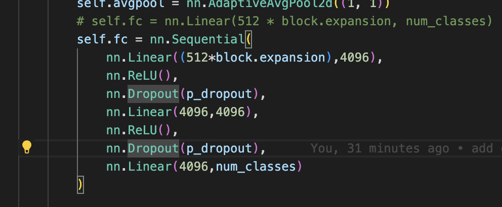
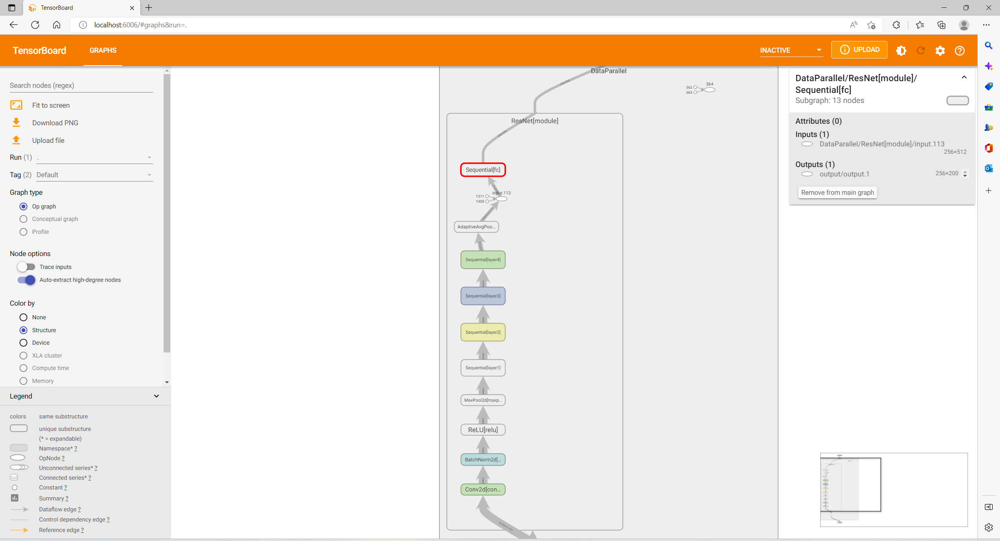

# 第二次大作业
## LeNet,AlexNet,ResNet示意图

## 1
LeNet中在ResNet中仍然存在的结构:
- 使用多个卷积层构建网络,不断减小特征图的大小,增加特征图的通道数。
- 通过下采样(maxPooling方法)减小特征图大小。
- 网络末端通过3个全连接层,输出维度等于类别数的预测向量。
- 都是通过多层网络,不断提取更深层次的特征的思想。

已弃用的结构:
- LeNet输出层采用Gaussian connection(GBF)径向基函数,而AlexNet中舍弃了这一结构。

## 2 AlexNet的改进
- 增加了网络的层数, 包含5个卷积层、2个全连接层和1个全连接输出层
- 将sigmoid激活函数改成了ReLU激活函数,计算更加简单
- 引入大量数据增广, 包括翻转、裁剪、颜色变化等, 缓解过拟合
- 引入dropout层, 缓解过拟合
- 支持在多个GPU上训练

## 3
ResNet中仍然存在
- ReLU激活函数.
- 数据增广,包括翻转、裁剪、颜色变化等.

ResNet中舍弃的:
- dropout层
- AlexNet中使用了3层全连接层,而ResNet中仅保留了最后一层全连接层
- 对于降采样,AlexNet中使用Maxpooling,而ResNet中使用步长为2的卷积层或Average pooling

## 4
### resnet结构分析
随着神经网络深度的不断增加,过多的层数会导致训练误差越来越高,引起模型优化的困难,导致性能退化.因此resnet使用残差映射(即让神经元去拟合差值$H(x)-x,H(x)为目标值$), 这样使得更容易得到期望的映射。
resnet的主要特征有
- 使用残差结构,对于每个block,输入x,输出$x+f(x)$,如图

- 对于较深层次的网络,使用bottle-neck代替原来的building block结构。该结构使用了1*1卷积核,将维度从256维减小为64维,以此来减少参数量,加快训练速度。

- Resnet中全部使用3*3、1*1等较小卷积核，不再包含5*5等大卷积核,进一步降低模型参数量, 形成小而深的网络。

### 问题
- 观察到相比于AlexNet,VGG-19, ResNet中去掉了网络末端将2维特征图展开后的3层全连接层,仅使用了输出维度等于样本类别数的一层全连接层代替。因此探究对于较浅的残差网络ResNet-18,加上这3层全连接层是否会对模型性能有所提升。
- 在3层全连接层中,为防止过拟合,AlexNet中用到了dropout来随机丢弃一些神经元。探究不同的丢弃概率p对任务的影响。

### 设计思路
实验的任务是Tiny-ImageSet下的图像分类,网络基本模型采用ResNet18, 基于torchvision中ResNet的实现。
- 首先修改models/resnet.py中的ResNet类,在__init__()函数中重新定义全连接层:

然后在forward()中使用。

- 其次在ResNet类中添加参数p_dropout,作为dropout层的丢弃概率。

- 最后修改`main.py` 文件，添加命令行参数`p_dropout`来设置dropout层。

- 下图为myresnet的网络结构

### 实验结果

|是否添加3层全连接层|dropout|acc@1|acc@5|平均每个epoch训练时间|训练epoch数|
| - | - | - | - | - | - |
|否(即原版ResNet)|/|39.360|64.080|28 s|37epoches|
|**是**|**0.3**|**40.110**|**66.000**|**31 s**|**32epoches**|
|是|0.5|39.510|65.080|31 s|30epoches|
|是|0.7|39.390|65.040|31 s | 30epoches|

### 结果分析
- 添加3层全连接层后,相比于原始的ResNet18,在tiny-ImageNet分类任务上性能有所提升,大约提升1个百分点左右。
- 由于添加3层全连接层后参数量增大,训练每个epoch所需时间变长。
- 对于此任务,在dropout的丢弃概率设为0.3时,取得最优的结果。可能原因是由于ResNet-18网络层数较浅, 不会造成较严重的过拟合。

### 代码组织
myresnet在文件`vision/resnet_with_dropout.py`中实现.`vision/`下的其他文件为torchvision实现resNet的代码。
具体的读取数据集、训练、评估等操作再`main.py`中实现。

### 代码复现
环境版本为pytorch==1.12.1,torchvision==0.13.1。
将`tiny_ImageNet_200_reorg`数据集解压后放在`data/`目录下。
从 [onedrive分享](https://1drv.ms/u/s!Akd7I0kiaXxrgTrE8tOaproWQUtU?e=lJ2Beg) 下载已训练好的模型文件,将四个log文件夹赋值到项目路径下。
#### 使用ResNet
在`main.py`line 28, 设置变量`ISMYNET`的值`False`.
然后运行`python main.py ./data --evaluate --resume ./logs_resnet/`,
便可以使用保存的模型文件进行测试。
#### 使用myResNet
在`main.py`line 28, 设置变量`ISMYNET`的值`True`.
然后运行`python main.py ./data --evaluate --resume ./logs_myresnet/model_best.pth.tar --p_dropout 0.5`.
通过修改参数为`--resume ./log_myresnet_dropout_0.3/model_best.pth.tar --p_dropout 0.3`或`--resume ./log_myresnet_dropout_0.7/model_best.pth.tar --p_dropout 0.7`来测试dropout概率为0.3与0.7时的模型

### 实验总结与心得体会
- 在模型设计方面, 评估不同模型时需要平衡模型性能与训练开销。如果只为提升1%的性能,却极大的增加了参数量与训练开销,是得不偿失的
- 在代码组织方面, 规范的定义函数接口以及清晰的注释对代码的维护有着极大的好处，例如得益于torchvision漂亮的源码,在为resnet添加参数`p_dropout`时,只需要在ResNet的类上直接添加,并赋一个初始值.这样在main函数中调用时只需多传入`model(...,p_dropout=0.3)`即可, 也不会影响已有代码的运行。
